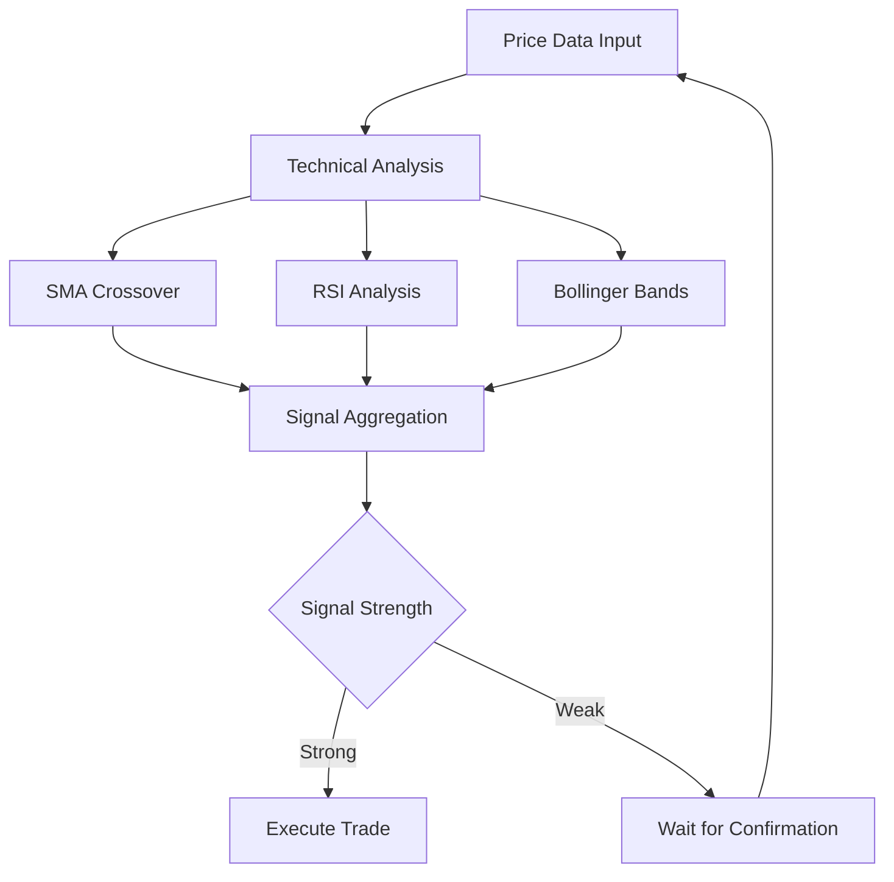

# AlphaFxTrader - Trading Logic Documentation

## Overview

The AlphaFxTrader trading system implements multiple algorithmic trading strategies with comprehensive risk management and performance monitoring. The system supports both manual and automated trading with real-time signal generation and execution.

## Trading Algorithm Flow Diagram

```
┌─────────────────────────────────────────────────────────────────┐
│                    TRADING ALGORITHM FLOW                      │
└─────────────────────────────────────────────────────────────────┘

┌─────────────┐    ┌─────────────┐    ┌─────────────┐    ┌─────────────┐
│ Price Data  │───▶│ Technical   │───▶│ Signal      │───▶│ Trade       │
│ Input       │    │ Analysis    │    │ Generation  │    │ Execution   │
└─────────────┘    └─────────────┘    └─────────────┘    └─────────────┘
       │                   │                   │                   │
       ▼                   ▼                   ▼                   ▼
┌─────────────┐    ┌─────────────┐    ┌─────────────┐    ┌─────────────┐
│ Real-time   │    │ SMA/EMA     │    │ Buy/Sell/   │    │ Order       │
│ Price Feed  │    │ RSI         │    │ Hold        │    │ Management  │
│             │    │ Bollinger   │    │ Signals     │    │             │
│             │    │ Bands       │    │             │    │             │
└─────────────┘    └─────────────┘    └─────────────┘    └─────────────┘
       │                   │                   │                   │
       ▼                   ▼                   ▼                   ▼
┌─────────────┐    ┌─────────────┐    ┌─────────────┐    ┌─────────────┐
│ Historical  │    │ Combined    │    │ Confidence  │    │ Risk        │
│ Data        │    │ Strategy    │    │ Scoring     │    │ Management  │
│ Storage     │    │ Analysis    │    │             │    │             │
└─────────────┘    └─────────────┘    └─────────────┘    └─────────────┘
```

## Core Trading Algorithms

### 1. Simple Moving Average (SMA) Crossover Strategy

#### Algorithm Description
The SMA crossover strategy generates buy and sell signals based on the intersection of two moving averages with different periods.

#### Implementation
```javascript
function smaCrossover(symbol, shortPeriod = 10, longPeriod = 20) {
  const prices = getPriceHistory(symbol);
  
  if (prices.length < longPeriod) {
    return { signal: 'HOLD', reason: 'Insufficient data' };
  }

  const shortSMA = calculateSMA(prices, shortPeriod);
  const longSMA = calculateSMA(prices, longPeriod);

  const currentShort = shortSMA[shortSMA.length - 1];
  const currentLong = longSMA[longSMA.length - 1];
  const previousShort = shortSMA[shortSMA.length - 2];
  const previousLong = longSMA[longSMA.length - 2];

  // Bullish crossover: short SMA crosses above long SMA
  if (previousShort <= previousLong && currentShort > currentLong) {
    return {
      signal: 'BUY',
      reason: 'Bullish SMA crossover',
      confidence: Math.abs(currentShort - currentLong) / currentLong
    };
  }

  // Bearish crossover: short SMA crosses below long SMA
  if (previousShort >= previousLong && currentShort < currentLong) {
    return {
      signal: 'SELL',
      reason: 'Bearish SMA crossover',
      confidence: Math.abs(currentShort - currentLong) / currentLong
    };
  }

  return { signal: 'HOLD', reason: 'No crossover detected' };
}
```

#### Signal Generation Logic
1. **Buy Signal**: Short SMA crosses above Long SMA
2. **Sell Signal**: Short SMA crosses below Long SMA
3. **Hold Signal**: No crossover detected

#### Parameters
- **Short Period**: 10 (default)
- **Long Period**: 20 (default)
- **Confidence**: Based on crossover magnitude

#### Performance Characteristics
- **Trend Following**: Works well in trending markets
- **Lagging Indicator**: Signals come after trend establishment
- **False Signals**: Prone to whipsaws in sideways markets

### 2. Relative Strength Index (RSI) Strategy

#### Algorithm Description
The RSI strategy uses mean reversion principles to identify overbought and oversold conditions.

#### Implementation
```javascript
function rsiStrategy(symbol, period = 14, overbought = 70, oversold = 30) {
  const prices = getPriceHistory(symbol);
  
  if (prices.length < period + 1) {
    return { signal: 'HOLD', reason: 'Insufficient data for RSI' };
  }

  const rsiValues = calculateRSI(prices, period);
  const currentRSI = rsiValues[rsiValues.length - 1];

  if (currentRSI > overbought) {
    return {
      signal: 'SELL',
      reason: 'RSI overbought',
      confidence: (currentRSI - overbought) / overbought
    };
  }

  if (currentRSI < oversold) {
    return {
      signal: 'BUY',
      reason: 'RSI oversold',
      confidence: (oversold - currentRSI) / oversold
    };
  }

  return { signal: 'HOLD', reason: 'RSI in neutral zone' };
}
```

#### Signal Generation Logic
1. **Buy Signal**: RSI < Oversold threshold (30)
2. **Sell Signal**: RSI > Overbought threshold (70)
3. **Hold Signal**: RSI between thresholds

#### Parameters
- **Period**: 14 (default)
- **Overbought**: 70 (default)
- **Oversold**: 30 (default)

#### Performance Characteristics
- **Mean Reversion**: Works well in ranging markets
- **Leading Indicator**: Can predict reversals
- **False Signals**: Can stay overbought/oversold in trends

### 3. Bollinger Bands Strategy

#### Algorithm Description
The Bollinger Bands strategy uses volatility-based signals to identify potential price reversals.

#### Implementation
```javascript
function bollingerBandsStrategy(symbol, period = 20, stdDev = 2) {
  const prices = getPriceHistory(symbol);
  
  if (prices.length < period) {
    return { signal: 'HOLD', reason: 'Insufficient data for Bollinger Bands' };
  }

  const bb = calculateBollingerBands(prices, period, stdDev);
  const currentBB = bb[bb.length - 1];
  const currentPrice = prices[prices.length - 1];

  // Price touches or breaks upper band - potential sell signal
  if (currentPrice >= currentBB.upper) {
    return {
      signal: 'SELL',
      reason: 'Price at upper Bollinger Band',
      confidence: (currentPrice - currentBB.upper) / currentBB.upper
    };
  }

  // Price touches or breaks lower band - potential buy signal
  if (currentPrice <= currentBB.lower) {
    return {
      signal: 'BUY',
      reason: 'Price at lower Bollinger Band',
      confidence: (currentBB.lower - currentPrice) / currentBB.lower
    };
  }

  return { signal: 'HOLD', reason: 'Price within Bollinger Bands' };
}
```

#### Signal Generation Logic
1. **Buy Signal**: Price touches or breaks lower band
2. **Sell Signal**: Price touches or breaks upper band
3. **Hold Signal**: Price within bands

#### Parameters
- **Period**: 20 (default)
- **Standard Deviation**: 2 (default)

#### Performance Characteristics
- **Volatility Based**: Adapts to market volatility
- **Mean Reversion**: Works well in ranging markets
- **Breakout Potential**: Can identify trend continuations

### 4. Combined Strategy

#### Algorithm Description
The combined strategy uses consensus from multiple algorithms to generate more reliable signals.

#### Implementation
```javascript
function combinedStrategy(symbol) {
  const smaSignal = smaCrossover(symbol);
  const rsiSignal = rsiStrategy(symbol);
  const bbSignal = bollingerBandsStrategy(symbol);

  const signals = [smaSignal, rsiSignal, bbSignal];
  const buySignals = signals.filter(s => s.signal === 'BUY').length;
  const sellSignals = signals.filter(s => s.signal === 'SELL').length;

  let finalSignal = 'HOLD';
  let confidence = 0;
  let reasons = [];

  if (buySignals >= 2) {
    finalSignal = 'BUY';
    confidence = buySignals / 3;
    reasons = signals.filter(s => s.signal === 'BUY').map(s => s.reason);
  } else if (sellSignals >= 2) {
    finalSignal = 'SELL';
    confidence = sellSignals / 3;
    reasons = signals.filter(s => s.signal === 'SELL').map(s => s.reason);
  }

  return {
    signal: finalSignal,
    confidence,
    reasons,
    individualSignals: {
      sma: smaSignal,
      rsi: rsiSignal,
      bollinger: bbSignal
    }
  };
}
```

#### Signal Generation Logic
1. **Buy Signal**: 2+ algorithms agree on BUY
2. **Sell Signal**: 2+ algorithms agree on SELL
3. **Hold Signal**: No consensus or mixed signals

#### Performance Characteristics
- **Consensus Based**: Reduces false signals
- **Higher Accuracy**: Better win rate than individual strategies
- **Lower Frequency**: Fewer trading opportunities

## Risk Management System

### 1. Volume Limits

#### Implementation
```javascript
class RiskManager {
  constructor(maxVolume = 10000000) {
    this.maxVolume = maxVolume;
    this.currentVolume = 0;
  }

  canExecuteTrade(trade) {
    const tradeValue = trade.quantity * trade.price;
    
    if (this.currentVolume + tradeValue > this.maxVolume) {
      return {
        allowed: false,
        reason: 'Maximum trading volume exceeded'
      };
    }
    
    return { allowed: true };
  }

  updateVolume(trade) {
    const tradeValue = trade.quantity * trade.price;
    this.currentVolume += tradeValue;
  }
}
```

#### Rules
- **Daily Volume Limit**: 10,000,000 (configurable)
- **Auto-trading Stop**: When limit reached
- **Manual Override**: Available for authorized users

### 2. Position Sizing

#### Implementation
```javascript
function calculatePositionSize(capital, riskPercentage, stopLoss) {
  const riskAmount = capital * (riskPercentage / 100);
  const positionSize = riskAmount / stopLoss;
  return Math.floor(positionSize);
}
```

#### Rules
- **Risk per Trade**: 1-2% of capital
- **Maximum Position**: 10% of capital
- **Stop Loss**: 2% default

### 3. Stop Loss and Take Profit

#### Implementation
```javascript
function setStopLossTakeProfit(trade, stopLossPercent = 2, takeProfitPercent = 3) {
  const stopLoss = trade.price * (1 - stopLossPercent / 100);
  const takeProfit = trade.price * (1 + takeProfitPercent / 100);
  
  return {
    stopLoss,
    takeProfit,
    stopLossPercent,
    takeProfitPercent
  };
}
```

#### Rules
- **Stop Loss**: 2% default
- **Take Profit**: 3% default (1.5:1 risk-reward ratio)
- **Trailing Stop**: Available for profitable positions

## Trade Execution Flow

### 1. Signal Generation



### 2. Trade Validation

```javascript
function validateTrade(trade) {
  const validations = [
    validateSymbol(trade.symbol),
    validateAction(trade.action),
    validateQuantity(trade.quantity),
    validatePrice(trade.price),
    validateRiskLimits(trade),
    validateMarketHours()
  ];

  const errors = validations.filter(v => !v.valid);
  
  if (errors.length > 0) {
    return {
      valid: false,
      errors: errors.map(e => e.message)
    };
  }

  return { valid: true };
}
```

### 3. Order Management

#### Order Types
1. **Market Orders**: Immediate execution at current price
2. **Limit Orders**: Execute at specified price or better
3. **Stop Orders**: Execute when price reaches trigger level

#### Order Lifecycle
```
PENDING → FILLED → CLOSED
    ↓
CANCELLED
    ↓
REJECTED
```

## Performance Monitoring

### 1. Key Performance Indicators (KPIs)

#### Trading Metrics
- **Win Rate**: Percentage of profitable trades
- **Profit Factor**: Gross profit / Gross loss
- **Sharpe Ratio**: Risk-adjusted returns
- **Maximum Drawdown**: Largest peak-to-trough decline
- **Average Trade**: Mean profit/loss per trade

#### Implementation
```javascript
function calculatePerformanceMetrics(trades) {
  const winningTrades = trades.filter(t => t.pnl > 0);
  const losingTrades = trades.filter(t => t.pnl < 0);
  
  const totalReturn = trades.reduce((sum, t) => sum + t.pnl, 0);
  const totalWins = winningTrades.reduce((sum, t) => sum + t.pnl, 0);
  const totalLosses = Math.abs(losingTrades.reduce((sum, t) => sum + t.pnl, 0));
  
  return {
    totalTrades: trades.length,
    winningTrades: winningTrades.length,
    losingTrades: losingTrades.length,
    winRate: (winningTrades.length / trades.length) * 100,
    totalReturn,
    profitFactor: totalLosses > 0 ? totalWins / totalLosses : 0,
    averageWin: winningTrades.length > 0 ? totalWins / winningTrades.length : 0,
    averageLoss: losingTrades.length > 0 ? totalLosses / losingTrades.length : 0
  };
}
```

### 2. Backtesting Framework

#### Historical Data Testing
```javascript
async function runBacktest(algorithm, symbol, startDate, endDate, initialCapital) {
  const priceData = await getHistoricalData(symbol, startDate, endDate);
  const trades = [];
  let capital = initialCapital;
  let position = 0;

  for (let i = 20; i < priceData.length; i++) {
    const currentPrice = priceData[i].price;
    const signal = algorithm.generateSignal(priceData.slice(0, i + 1));

    if (signal.signal === 'BUY' && position <= 0) {
      const quantity = Math.floor(capital * 0.1 / currentPrice);
      if (quantity > 0) {
        capital -= quantity * currentPrice;
        position += quantity;
        trades.push({ action: 'BUY', quantity, price: currentPrice });
      }
    } else if (signal.signal === 'SELL' && position > 0) {
      const proceeds = position * currentPrice;
      capital += proceeds;
      trades.push({ action: 'SELL', quantity: position, price: currentPrice });
      position = 0;
    }
  }

  return calculatePerformanceMetrics(trades);
}
```

### 3. Real-time Monitoring

#### Performance Dashboard
- **Live P&L**: Real-time profit/loss tracking
- **Trade Statistics**: Current session metrics
- **Algorithm Performance**: Individual strategy performance
- **Risk Metrics**: Current risk exposure

## Algorithm Optimization

### 1. Parameter Optimization

#### Grid Search
```javascript
function optimizeParameters(algorithm, symbol, parameterRanges) {
  const results = [];
  
  for (const params of generateParameterCombinations(parameterRanges)) {
    const performance = runBacktest(algorithm, symbol, params);
    results.push({ params, performance });
  }
  
  return results.sort((a, b) => b.performance.sharpeRatio - a.performance.sharpeRatio);
}
```

#### Genetic Algorithm
```javascript
function geneticOptimization(algorithm, symbol, populationSize = 50, generations = 100) {
  let population = generateRandomPopulation(populationSize);
  
  for (let gen = 0; gen < generations; gen++) {
    const fitness = population.map(individual => 
      runBacktest(algorithm, symbol, individual.params)
    );
    
    population = evolvePopulation(population, fitness);
  }
  
  return population[0]; // Best individual
}
```

### 2. Machine Learning Integration

#### Feature Engineering
```javascript
function extractFeatures(priceData) {
  return {
    sma10: calculateSMA(priceData, 10),
    sma20: calculateSMA(priceData, 20),
    rsi: calculateRSI(priceData, 14),
    bbUpper: calculateBollingerBands(priceData, 20, 2).upper,
    bbLower: calculateBollingerBands(priceData, 20, 2).lower,
    volume: priceData.map(p => p.volume),
    volatility: calculateVolatility(priceData, 20)
  };
}
```

#### Model Training
```javascript
function trainMLModel(features, labels) {
  const model = new LogisticRegression();
  model.fit(features, labels);
  return model;
}
```

## Error Handling and Recovery

### 1. Data Quality Checks

#### Price Data Validation
```javascript
function validatePriceData(priceData) {
  const errors = [];
  
  for (let i = 1; i < priceData.length; i++) {
    const current = priceData[i];
    const previous = priceData[i - 1];
    
    // Check for missing data
    if (!current.price || !current.timestamp) {
      errors.push(`Missing data at index ${i}`);
    }
    
    // Check for unrealistic price movements
    const priceChange = Math.abs(current.price - previous.price) / previous.price;
    if (priceChange > 0.1) { // 10% change
      errors.push(`Unrealistic price movement at index ${i}`);
    }
  }
  
  return errors;
}
```

### 2. System Recovery

#### Automatic Recovery
```javascript
class TradingSystem {
  async recoverFromError(error) {
    console.error('Trading system error:', error);
    
    // Stop auto-trading
    this.autoTrading = false;
    
    // Notify administrators
    await this.sendAlert('Trading system error', error.message);
    
    // Attempt recovery
    try {
      await this.reconnectToDataFeed();
      await this.validateSystemState();
      this.autoTrading = true;
    } catch (recoveryError) {
      console.error('Recovery failed:', recoveryError);
    }
  }
}
```

## Compliance and Reporting

### 1. Trade Reporting

#### Regulatory Compliance
- **Trade Timestamps**: Precise execution times
- **Order Audit Trail**: Complete order history
- **Risk Metrics**: Real-time risk monitoring
- **Performance Reporting**: Regular performance updates

### 2. Audit Trail

#### Complete Transaction Log
```javascript
function logTrade(trade, metadata) {
  const auditEntry = {
    timestamp: new Date(),
    tradeId: trade.id,
    action: trade.action,
    symbol: trade.symbol,
    quantity: trade.quantity,
    price: trade.price,
    algorithm: trade.algorithm,
    user: metadata.user,
    ip: metadata.ip,
    session: metadata.session
  };
  
  await database.insert('audit_log', auditEntry);
}
```

This comprehensive trading logic documentation provides the foundation for implementing robust, scalable, and profitable algorithmic trading strategies in the AlphaFxTrader system.

